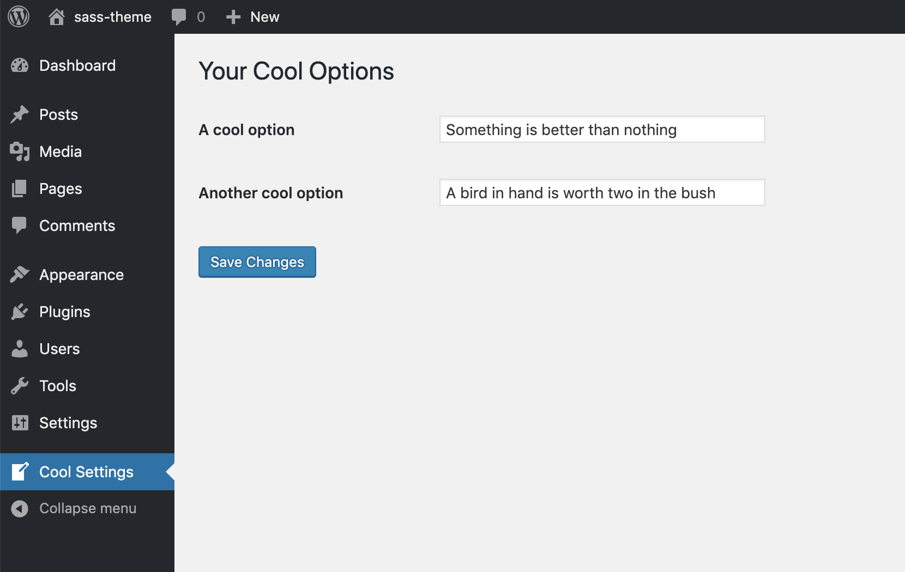
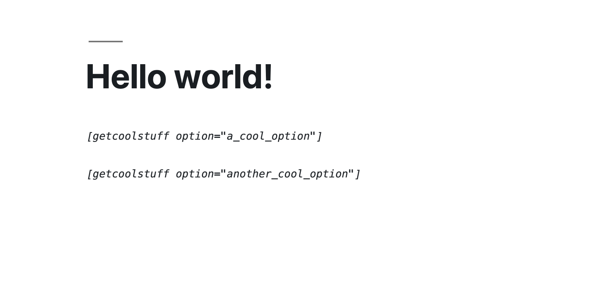
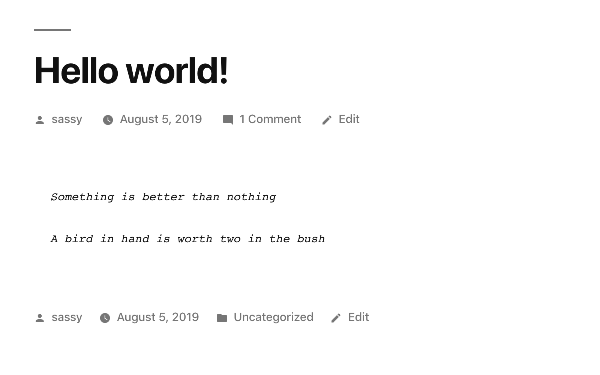

# WP Get Options 

A demo wordpress plugins that lets you set a couple of options in the backend using wordpress settings API and then get them using a shortcode

### Usage 

```
[getcoolstuff option="a_cool_option"]

``` 

or 

```
[getcoolstuff option="another_cool_option"]
```

Since it's basically a wrapper on top of [get_option](https://developer.wordpress.org/reference/functions/get_option/) , it can get you any option's value. 

So it can be used like:

```
[getcoolstuff option="my_option_name"]
``` 

# Example setup

Lets say you have saved your options like the following:




And the options are named `a_cool_option`  and `my_option_name ` as in the plugin, you can retrieve them by using the shortcodes above like: 



and they will display on the front end like:




